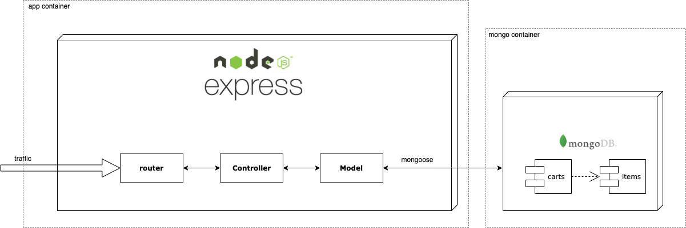

# Cart REST API

This is my personal Cart REST API repository, built with [Node.js](https://nodejs.org/), [Express.js](https://expressjs.com/), [MongoDB](https://www.mongodb.com/) and [Docker](https://www.docker.com/).

## Table of contents

- [Getting started](#getting-started)
- [Architecture](#architecture)
- [API endpoints](#api-endpoints)
- [Features](#features)
  - [Considerations](#considerations)
  - [Limitations](#features)
- [Next steps](#next-steps)

## Getting started

1. Clone this git repository:

```bash
git clone https://github.com/davcd/cart-rest-api.git
cd cart-rest-api
```

2. Configure your `.env` file
3. Run the API with docker-compose :

```bash
docker-compose up
```

4. Retrieve test logs

```bash
docker logs -f cart-rest-api_test_1
```

5. Test API with [Postman](https://www.getpostman.com/) (See collection and environment files on `/docs` folder)

## Architecture

The choosen architecture is Javascript based. The runtime is [Node.js](https://nodejs.org/), the framework is [Express.js](https://expressjs.com/), the database is [MongoDB](https://www.mongodb.com/). The entire project is [Docker](https://www.docker.com/)ized for easy develompent and testing.

For connecting the Express.js framework with MongoDB the selected ODM is [Mongoose](https://mongoosejs.com/)

<details><summary markdown="span"><strong>Why this architecture?</strong></summary>

The pros are:

- **Easy transition for cloud serverless stack.** (e.g. Serverless framework, AWS Lambda, AWS DynamoDB, aws API Gateway).
- **Get out of my comfort zone.** Do not use my daily languages.
- **Quick prototype**
- **Simple code**
- **Successful stack**. This stack has positioned itself very well in the market. Due its caracteristics is wide recognized. (e.g. Simplicity, minimalism, flexibility, scalability, performance,... )

The cons are:

- **Poor Swagger compatibility**.

> Note: It is debatable that document store is not be the best database model for this particular business.

</details>
<details><summary markdown="span">Initial ideas</summary>

When choosen the stack, I contemplated the option of using these others:

- Java: Spring Boot based with Postgres database and Hibernate as ORM.
- PHP: Laravel framework with Postgres as persistence, using Doctrine as ORM

</details>

<p align="center"></p>

## API endpoints

For simplicity, every data passed to a endpoint will be allocated as params.

> Note: Errors are shown with the following pattern `{ "error" : "Error message text" }`

#### cart

<details><summary markdown="span"><i>POST</i> <strong>/cart/</strong></summary>

Creates a new cart

**Parameters**

No parameters

**Responses**

```javascript
{
    "cart_code": String
}

//Example

{
    "cart_code": "4ca13090-a1b2-4741-b066-66c8d7a39f90"
}

```

| Code | Description          |
| ---- | -------------------- |
| 201  | Successful operation |
|      |                      |
| 500  | Error creating cart  |

</details>
<details><summary markdown="span"><i>GET</i>  <strong>/cart/</strong></summary>

Retrieves a cart

**Parameters**

| Name      | Value  |
| --------- | ------ |
| cart_code | String |

**Responses**

```javascript
{
    "cart_code": String,
    "date": Date,
    "items": [
        {
            "item": {
                "item_code": String,
                "date": Date,
                "name": String,
                "description": String,
                "image": String,
                "price": Number
            },
            "meta": {
                "quantity": Number,
            }
      	}
	]
}

//Examples

{
    "cart_code": "7cf76646-8403-4d3c-976d-df148e6be29e",
    "date": "2019-12-31T00:14:02.213Z",
    "items": []
}

{
    "cart_code": "7cf76646-8403-4d3c-976d-df148e6be29e",
    "date": "2019-12-31T00:14:02.213Z",
    "items": [
        {
            "item": {
                "item_code": "3892211b-1d99-43d1-a4f8-a8a2255820f9",
                "date": "2019-12-31T00:15:39.330Z",
                "name": "officia veniam nulla",
                "description": "Voluptate et occaecat exercitation Lorem ex do quis laboris.",
                "image": "est.jpg",
                "price": 260.67
            },
            "meta": {
                "quantity": 2
            }
        }
    ]
}

```

| Code | Description           |
| ---- | --------------------- |
| 200  | Successful operation  |
|      |                       |
| 400  | Incorrect cart_code   |
| 404  | Cart not found        |
| 500  | Error retrieving cart |

</details>
<details><summary markdown="span"><i>DELETE</i>  <strong>/cart/</strong></summary>

Removes a cart

**Parameters**

| Name      | Value  |
| --------- | ------ |
| cart_code | String |

**Responses**

No responses

| Code | Description          |
| ---- | -------------------- |
| 204  | Successful operation |
|      |                      |
| 400  | Incorrect cart_code  |
| 404  | Cart not found       |
| 500  | Error deleting cart  |

</details>

#### item

<details><summary markdown="span"><i>POST</i>  <strong>/item/</strong></summary>

Creates a new random item

**Parameters**

No parameters

**Responses**

```javascript
{
    "item_code": String
}

//Example

{
    "item_code": "290bcb1b-de37-40ed-a7ea-bcab78a84f7c"
}

```

| Code | Description          |
| ---- | -------------------- |
| 201  | Successful operation |
|      |                      |
| 500  | Error creating item  |

</details>
<details><summary markdown="span"><i>GET</i>  <strong>/item/</strong></summary>

Retrieves an item

**Parameters**

| Name      | Value  |
| --------- | ------ |
| item_code | String |

**Responses**

```javascript
{
    "item_code": String,
    "date": Date,
    "name": String,
    "description": String,
    "image": String,
    "price": Number
}

//Example

{
    "item_code": "290bcb1b-de37-40ed-a7ea-bcab78a84f7c",
    "date": "2019-12-31T00:23:04.607Z",
    "name": "deserunt enim laboris",
    "description": "Est fugiat laborum eu mollit quis id.",
    "image": "aute.jpg",
    "price": 412.52
}

```

| Code | Description           |
| ---- | --------------------- |
| 200  | Successful operation  |
|      |                       |
| 400  | Incorrect item_code   |
| 404  | Item not found        |
| 500  | Error retrieving item |

</details>

#### cart.items

<details><summary markdown="span"><i>GET</i>  <strong>/cart/items/</strong></summary>

Retrieves list of items in cart

**Parameters**

| Name      | Value  |
| --------- | ------ |
| cart_code | String |

**Responses**

```javascript
[
    {
        "item": {
            "item_code": String,
            "date": Date,
            "name": String,
            "description": String,
            "image": String,
            "price": Number
        },
        "meta": {
            "quantity": Number,
        }
    }
]


//Examples

[]

[
    {
        "item": {
            "item_code": "290bcb1b-de37-40ed-a7ea-bcab78a84f7c",
            "date": "2019-12-31T00:23:04.607Z",
            "name": "deserunt enim laboris",
            "description": "Est fugiat laborum eu mollit quis id.",
            "image": "aute.jpg",
            "price": 412.52
        },
        "meta": {
            "quantity": 2
        }
    },
    {
        "item": {
            "item_code": "e2791720-2e01-4fc6-b6bb-5d381742474e",
            "date": "2019-12-31T00:31:47.452Z",
            "name": "fugiat amet elit",
            "description": "Cupidatat et minim in exercitation proident ea quis reprehenderit nisi.",
            "image": "enim.jpg",
            "price": 728.94
        },
        "meta": {
            "quantity": 2
        }
    }
]

```

| Code | Description                 |
| ---- | --------------------------- |
| 204  | Successful operation        |
|      |                             |
| 400  | Incorrect cart_code         |
| 404  | Cart not found              |
| 500  | Error retrieving cart items |

</details>
<details><summary markdown="span"><i>POST</i>  <strong>/cart/items/</strong></summary>

Adds / modifies / removes a cart item

```
if (quantity is positive){
    if(item previously exists in the cart){
        Modifies the quantities by adding them
    }else{
        Adds the item into the cart with the defined quantity
    }
}else{
    if(item previously exists in the cart){
        Modifies the quantities by subtracting them
        if(the quantities result is zero or less){
            Removes item from cart
        }
    }else{
        Does nothing
    }
}
```

**Parameters**

| Name                | Value  |
| ------------------- | ------ |
| cart_code           | String |
| item_code           | String |
| quantity (optional) | Number |

**Responses**

```javascript
[
    {
        "item": {
            "item_code": String,
            "date": Date,
            "name": String,
            "description": String,
            "image": String,
            "price": Number
        },
        "meta": {
            "quantity": Number,
        }
    }
]


//Examples

[]

[
    {
        "item": {
            "item_code": "290bcb1b-de37-40ed-a7ea-bcab78a84f7c",
            "date": "2019-12-31T00:23:04.607Z",
            "name": "deserunt enim laboris",
            "description": "Est fugiat laborum eu mollit quis id.",
            "image": "aute.jpg",
            "price": 412.52
        },
        "meta": {
            "quantity": 2
        }
    },
    {
        "item": {
            "item_code": "e2791720-2e01-4fc6-b6bb-5d381742474e",
            "date": "2019-12-31T00:31:47.452Z",
            "name": "fugiat amet elit",
            "description": "Cupidatat et minim in exercitation proident ea quis reprehenderit nisi.",
            "image": "enim.jpg",
            "price": 728.94
        },
        "meta": {
            "quantity": 2
        }
    }
]

```

| Code | Description               |
| ---- | ------------------------- |
| 200  | Successful operation      |
|      |                           |
| 400  | Incorrect cart_code       |
| 404  | Cart not found            |
| 400  | Incorrect item_code       |
| 404  | Item not found            |
| 500  | Error modifying cart item |

</details>

## Features

- Cart ( _create / get / remove_ )
- Item ( _create / get_ )
- Retrieves cart items ( _get_ )
- Adds / modifies / removes cart item ( _modify_ )

### Considerations

- Web/Mobile Application must handle the `cart_code` (session, cookie, or persistence if loged in user)

### Limitations

- The is no stock limit for any item.
- For a reald-world cart there must be more considerations than `quantity` (e.g. sizes, colors, discounts) and thus API should handle them.
- For a real-world app, there is no need of creating empty carts. Carts should be created when user adds an item and not before. For this reason call two endpoints ( _POST_ **/cart/** and _POST_ **/cart/items/** ) for perform this operation is not the best approach.

> Note: This can be handle by allowing to call _POST_ **/cart/items/** without a `cart_code` and create it automatically.

## Next steps

- Tests cases completion
- Tests code refactor
- MongoDB memory server configuration for testing
- End to end testing ( _Swagger_ or _[newman](https://github.com/postmanlabs/newman)_ )
- Adapt to cloud serverless architecture
